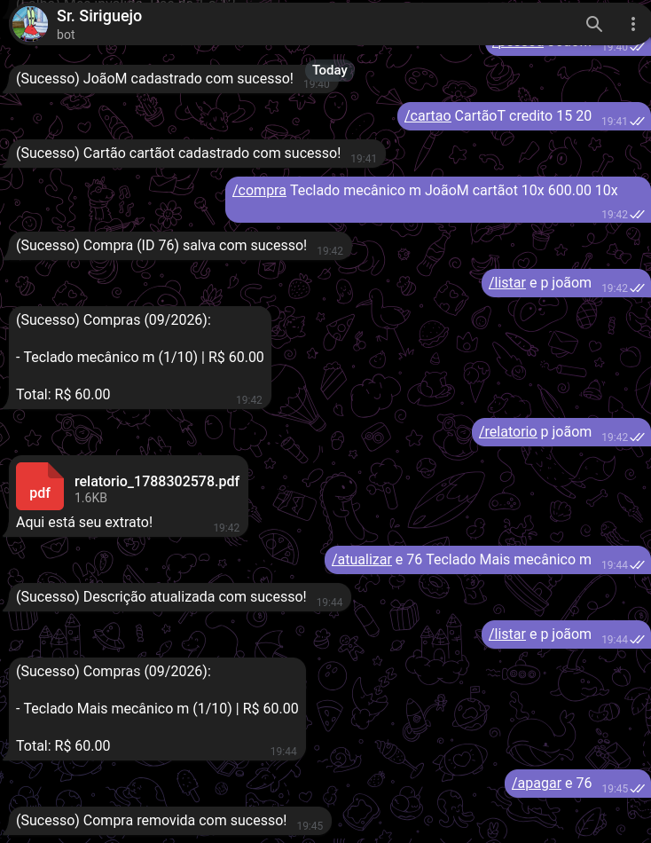
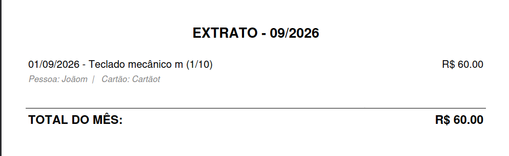

<a id="readme-top"></a>

[![Stargazers][stars-shield]][stars-url]
[![Issues][issues-shield]][issues-url]
[![GPL License][license-shield]][license-url]
[![LinkedIn][linkedin-shield]][linkedin-url]

<br />
<div align="center">
  <h3 align="center">💸 Manii-Bot</h3>

  <p align="center">
    Um bot de Telegram para controle financeiro pessoal e gestão de faturas de cartão de crédito, desenvolvido em Go.
    <br />
    <a href="https://github.com/GiuTP/Manii-Bot/issues/new?labels=bug">Reportar Bug</a>
    &middot;
    <a href="https://github.com/GiuTP/Manii-Bot/issues/new?labels=enhancement">Sugerir Melhoria</a>
  </p>
</div>

---

<!-- SUMÁRIO -->
<details>
  <summary>Sumário</summary>
  <ol>
    <li><a href="#-sobre-o-projeto">Sobre o Projeto</a>
      <ul>
        <li><a href="#-construído-com">Construído com</a></li>
      </ul>
    </li>
    <li><a href="#-funcionalidades">Funcionalidades</a></li>
    <li><a href="#-comandos">Comandos</a></li>
    <li><a href="#-demonstração">Demonstração</a></li>
    <li><a href="#-estrutura-do-projeto">Estrutura do Projeto</a></li>
    <li>
      <a href="#-instalação">Instalação</a>
      <ul>
        <li><a href="#-pré-requisitos">Pré-requisitos</a></li>
        <li><a href="#-configuração-e-execução">Configuração e Execução</a></li>
      </ul>
    </li>
    <li><a href="#-licença">Licença</a></li>
    <li><a href="#-contato">Contato</a></li>
  </ol>
</details>

---

## 💰 Sobre o Projeto



**Manii-Bot** é um bot de Telegram desenvolvido em Go para substituir planilhas complexas de controle financeiro por uma interface conversacional rápida e acessível de qualquer dispositivo.

Ele recebe comandos simples pelo chat, calcula projeções de parcelamentos respeitando datas de fechamento de fatura, gerencia gastos recorrentes e consolida os lançamentos mensais em relatórios detalhados em PDF.

> O projeto está funcional e pronto para uso, porém ainda em desenvolvimento ativo — bugs e melhorias podem surgir.

<p align="right">(<a href="#readme-top">voltar ao topo</a>)</p>

### 🛠 Construído com

* [![Go][Go-badge]][Go-url]
* [![SQLite][SQLite-badge]][SQLite-url]
* [![Telegram][Telegram-badge]][Telegram-url]

<p align="right">(<a href="#readme-top">voltar ao topo</a>)</p>

---

## ✨ Funcionalidades

- **Cadastro rápido de despesas** — registre compras avulsas ou parceladas com uma única mensagem.
- **Cálculo inteligente de fatura** — o bot entende dias de fechamento e vencimento de diferentes cartões, alocando parcelas automaticamente nos meses corretos.
- **Gestão de compras recorrentes** — controle de gastos fixos mensais (ex.: streamings e assinaturas).
- **Extratos mensais em PDF** — geração de relatórios filtrados por mês, pessoa ou cartão.
- **Multi-usuário** — suporte para dividir e rastrear gastos entre diferentes pessoas.

<p align="right">(<a href="#readme-top">voltar ao topo</a>)</p>

---

## 🤖 Comandos

| Comando | Descrição | Exemplo |
|---------|-----------|---------|
| `/compra` | Registra uma despesa (avulsa ou parcelada) | `/compra 120.00 Tênis pedro nubank 3x` |
| `/pessoa` | Cadastra uma pessoa no sistema | `/pessoa joão` |
| `/cartao` | Cadastra um cartão | `/cartao nubank credito 25 2` |
| `/listar e` | Lista despesas (mês atual se omitido) | `/listar e 08` |
| `/listar e p` | Lista despesas filtradas por pessoa | `/listar e p joão 08` |
| `/listar p` | Lista pessoas cadastradas | `/listar p ativos` |
| `/apagar` | Desativa pessoa/cartão ou deleta despesa | `/apagar e 15` |
| `/ativar` | Reativa pessoa ou cartão desativado | `/ativar p joão` |
| `/help` | Exibe a lista completa de comandos | `/help` |

> Para a lista completa com todas as sintaxes e detalhamentos, envie `/help` ao bot.

<p align="right">(<a href="#readme-top">voltar ao topo</a>)</p>

---

## 📸 Demonstração

### Conversa com o Bot

Um exemplo de fluxo completo de uso:

1. **Criação de entidades** — cadastro de pessoa (`JoãoM`) e cartão (`CartãoT`).
2. **Registro de despesa** — inserção de uma compra parcelada vinculando pessoa e cartão.
3. **Consulta e filtros** — listagem filtrada por responsável (`JoãoM`).
4. **Relatório** — geração do extrato mensal em PDF.
5. **Manutenção** — atualização da descrição da despesa e posterior remoção do registro.


### Layout do Relatório Gerado

O extrato exportado organiza os lançamentos com ordenação, detalhes de parcelamento e linhas divisórias:



<p align="right">(<a href="#readme-top">voltar ao topo</a>)</p>

---

## 📁 Estrutura do Projeto

```
Manii-Bot/
├── cmd/
│   └── bot/
│       └── main.go          ponto de entrada da aplicação
├── docs/
│   └── screenshots/         capturas de tela para documentação
├── internal/
│   ├── config/              carregamento de variáveis de ambiente
│   ├── domain/              entidades do domínio
│   │   ├── card.go          modelo de cartão
│   │   ├── expense.go       modelo de despesa
│   │   ├── installment.go   lógica de parcelamento e datas de fatura
│   │   ├── person.go        modelo de pessoa
│   │   ├── report.go        modelo de relatório
│   │   └── subscription.go  modelo de assinatura recorrente
│   ├── parser/              parsing dos comandos do Telegram
│   ├── repository/          camada de acesso ao banco de dados (SQLite)
│   ├── services/            regras de negócio e orquestração
│   │   ├── bot_service.go
│   │   ├── card_service.go
│   │   ├── expense_service.go
│   │   ├── person_service.go
│   │   ├── report_service.go
│   │   ├── subscription_service.go
│   │   └── help.txt         texto de ajuda exibido pelo /help
│   └── telegram/
│       └── bot.go           configuração e roteamento do bot
├── .env.example             exemplo de variáveis de ambiente
├── go.mod
├── go.sum
└── README.md
```

<p align="right">(<a href="#readme-top">voltar ao topo</a>)</p>

---

## 🚀 Instalação

### 📦 Pré-requisitos

- **Go** 1.21 ou superior
- **GCC** instalado (necessário para o driver CGO do SQLite3)
- Um **token de bot** do Telegram (obtenha via [@BotFather](https://t.me/BotFather))

No Ubuntu/Debian:

```sh
sudo apt install golang gcc
```

### ⚙ Configuração e Execução

1. Clone o repositório:
   ```sh
   git clone git@github.com:GiuTP/Manii-Bot.git
   cd Manii-Bot
   ```

2. Baixe as dependências:
   ```sh
   go mod tidy
   ```

3. Configure as variáveis de ambiente criando um arquivo `.env` na raiz:
   ```env
   TELEGRAM_TOKEN=SEU_TOKEN_AQUI   # obtido via @BotFather
   ALLOWED_USERS=SEU_ID_TELEGRAM   # obtido via @userinfobot
   DB_PATH=caminho/para/finance.db
   ```

4. Execute o bot:
   ```sh
   go run cmd/bot/main.go
   ```

> Na primeira execução, o bot criará automaticamente o arquivo do banco de dados e todas as tabelas necessárias.

<p align="right">(<a href="#readme-top">voltar ao topo</a>)</p>

---

## 📄 Licença

Este projeto está distribuído sob a licença **GPLv3**. Consulte o arquivo [`LICENSE`](LICENSE) para mais informações.

<p align="right">(<a href="#readme-top">voltar ao topo</a>)</p>

---

## 📬 Contato

GiuTP — [github.com/GiuTP](https://github.com/GiuTP)

E-mail — giulianotpt@gmail.com

Link do projeto: [https://github.com/GiuTP/Manii-Bot](https://github.com/GiuTP/Manii-Bot)

<p align="right">(<a href="#readme-top">voltar ao topo</a>)</p>

---

## 🙏 Agradecimentos

* [Best-README-Template](https://github.com/othneildrew/Best-README-Template) — template base deste README

<p align="right">(<a href="#readme-top">voltar ao topo</a>)</p>

---

<!-- MARKDOWN LINKS & IMAGES -->
[stars-shield]: https://img.shields.io/github/stars/GiuTP/Manii-Bot.svg?style=for-the-badge
[stars-url]: https://github.com/GiuTP/Manii-Bot/stargazers
[issues-shield]: https://img.shields.io/github/issues/GiuTP/Manii-Bot.svg?style=for-the-badge
[issues-url]: https://github.com/GiuTP/Manii-Bot/issues
[license-shield]: https://img.shields.io/github/license/GiuTP/Manii-Bot.svg?style=for-the-badge
[license-url]: https://github.com/GiuTP/Manii-Bot/blob/main/LICENSE
[linkedin-shield]: https://img.shields.io/badge/-LinkedIn-black.svg?style=for-the-badge&logo=linkedin&colorB=555
[linkedin-url]: https://www.linkedin.com/in/giuliano-tavares/
[Go-badge]: https://img.shields.io/badge/Go-00ADD8?style=for-the-badge&logo=go&logoColor=white
[Go-url]: https://go.dev/
[SQLite-badge]: https://img.shields.io/badge/SQLite-003B57?style=for-the-badge&logo=sqlite&logoColor=white
[SQLite-url]: https://www.sqlite.org/
[Telegram-badge]: https://img.shields.io/badge/Telegram-2CA5E0?style=for-the-badge&logo=telegram&logoColor=white
[Telegram-url]: https://core.telegram.org/bots/api